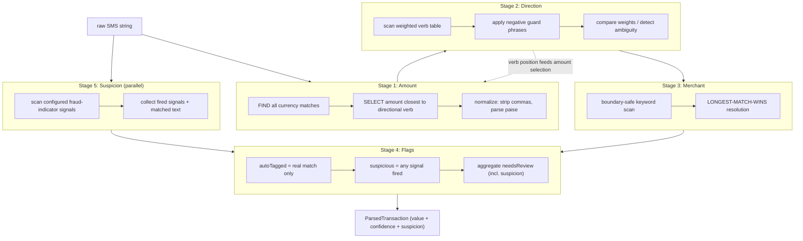
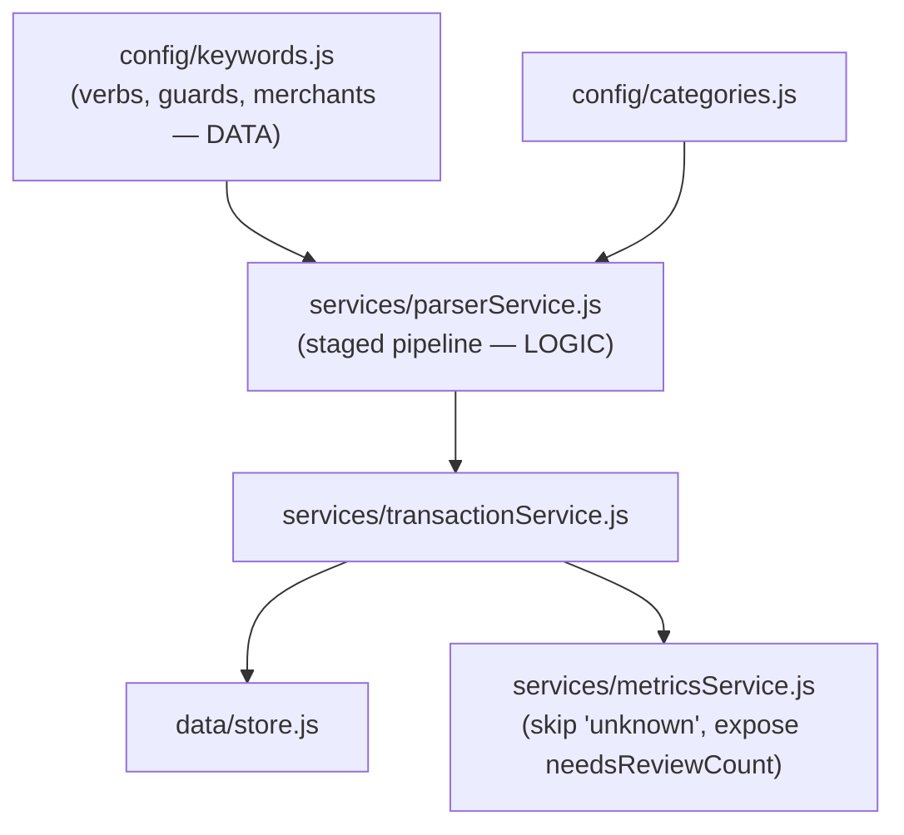

# Design Document: Robust Transaction Parser

## Overview

This enhancement reworks `parserService.js` from a "first match wins, always tag" parser into a **staged, confidence-aware pipeline**. The guiding philosophy is **zero silent failures**: every stage emits BOTH a value AND a confidence/flag, never a bare value. 100% regex/keyword accuracy on free-text bank SMS (HDFC/ICICI/SBI all phrase alerts differently) is not achievable; the achievable goal is that every output is either correct or explicitly flagged as uncertain — never confidently wrong. The current parser violates this by setting `autoTagged=true` whenever it parses anything and by defaulting `direction` to `'debit'`, both of which hide errors from the user.

The pipeline keeps the existing layered architecture intact: **config holds data, services hold logic**. New guard lists and the weighted-verb table live in `src/config/keywords.js` as pure data, so adding a merchant or tuning a verb weight never touches parsing code. The output record gains confidence/flag fields and currency metadata, and a top-level `needsReview` signal aggregates all per-stage uncertainty for use as a production quality proxy.

This design also extends the pipeline with a **Stage 5 Suspicion_Detector** so the parser can accept arbitrary free-form SMS pasted into a demo input box — genuine bank alert, promotional message, or fraud/spam/phishing — and still extract amount, direction, and category while additionally flagging deceptive messages. Suspicion is a **heuristic, additive** signal: it never rejects or blocks a transaction. The fraud-indicator signals and their patterns live in `src/config/keywords.js` as pure data (consistent with "config holds data"), the record gains a boolean `suspicious` flag plus `suspicionMeta`, and a fired suspicion verdict escalates `needsReview` to `true` so the message surfaces for review.

## Architecture

The parser is a four-stage pipeline. Each stage is a pure function that takes the raw text (and, for amount, the located verb position) and returns a value plus a confidence/flag meta object. `parseAlert` orchestrates the stages and assembles the `ParsedTransaction`. Config (`keywords.js`, `categories.js`) supplies data only; all logic lives in the service layer. A fifth stage, the Suspicion_Detector, runs in parallel on the raw text and contributes a fraud-signal verdict that the flag stage folds into `needsReview`.

### Main Algorithm / Workflow



Note the dependency arrow: Stage 2 (direction) locates the directional verb, and Stage 1 (amount) selects the amount closest to that verb. The implementation therefore runs verb-location *before* amount-selection internally, even though amount conceptually comes first. See "Stage ordering" under Integration. Stage 5 (Suspicion) is independent of Stages 1–3: it reads only the raw text, so a high-confidence parse can still be flagged suspicious, and its verdict enters the record solely through Stage 4's `suspicious` flag and the `needsReview` aggregation.

## Data Models

### ParsedTransaction Record Schema

The schema is the contract for `store.insert()` and `metricsService.computeMetrics()`. New fields are additive; existing consumers keep working.

```javascript
/**
 * @typedef {Object} ParsedTransaction
 *
 * // ---- core values (existing) ----
 * @property {string}      rawMessage    Trimmed original SMS.
 * @property {string}      description   Whitespace-collapsed human text.
 * @property {number|null} amount        Selected amount; null if none found.
 * @property {'credit'|'debit'|'unknown'} direction  Third state allowed.
 * @property {string}      category      Category id; MISC fallback.
 * @property {string|null} merchant      Matched keyword, or null.
 * @property {object|null} expectedSavings  Reward sub-metric (unchanged).
 *
 * // ---- NEW: flags ----
 * @property {boolean}     autoTagged    TRUE only on a real merchant match.
 * @property {boolean}     needsReview   Aggregate uncertainty signal (now also raised by suspicion).
 *
 * // ---- NEW: suspicion (Stage 5) ----
 * @property {boolean}     suspicious    TRUE when one or more fraud-indicator signals fired.
 * @property {SuspicionMeta} suspicionMeta  Which signals fired and the matched text.
 *
 * // ---- NEW: per-stage confidence ----
 * @property {AmountMeta}    amountMeta
 * @property {DirectionMeta} directionMeta
 * @property {MerchantMeta}  merchantMeta
 *
 * // ---- NEW: debug trace (logged alongside result) ----
 * @property {MatchTrace}  trace
 */

/**
 * @typedef {Object} AmountMeta
 * @property {string|null} currencySymbol   "Rs" | "INR" | "₹" | null (metadata, kept separate from amount).
 * @property {number}      candidateCount    How many currency matches were found.
 * @property {number|null} selectedIndex     Char offset of the chosen match.
 * @property {'high'|'low'|'none'} confidence high=1 candidate or clear winner; low=guessed among many; none=null amount.
 */

/**
 * @typedef {Object} DirectionMeta
 * @property {number}  creditWeight        Summed weight of credit verbs (post-guard).
 * @property {number}  debitWeight         Summed weight of debit verbs (post-guard).
 * @property {'high'|'low'|'none'} confidence high=clear winner; low=weights close; none=no verb.
 * @property {string[]} guardedOut         Verb hits suppressed by negative guards.
 */

/**
 * @typedef {Object} MerchantMeta
 * @property {boolean} matched
 * @property {number}  matchLength         Length of winning keyword (for longest-wins audit).
 * @property {string|null} category
 */

/**
 * @typedef {Object} MatchTrace
 * @property {string|null} amountSubstring   Exact text matched for the amount.
 * @property {string[]}    directionVerbs    Verbs that fired (post-guard).
 * @property {string|null} merchantKeyword   Winning keyword.
 * @property {string[]}    suspicionSignals  Ids of fraud-indicator signals that fired (empty if none).
 */

/**
 * @typedef {Object} SuspicionMeta
 * @property {Array<{ id: string, match: string }>} signals  One entry per fired signal: the signal id and the verbatim matched substring.
 * @property {number} signalCount   Number of distinct fraud-indicator signals that fired (0 when none).
 */
```

### Config Data Structures (live in `src/config/keywords.js`)

Pure data, no logic. Adding a merchant or tuning a weight is a data edit only.

```javascript
/**
 * Weighted verb table (replaces flat DEBIT_HINTS / CREDIT_HINTS arrays).
 * Strong verbs (debited/credited) dominate weak ones ("txn of").
 * direction is the polarity; weight is the confidence contribution.
 */
const DIRECTION_VERBS = [
  // strong debit
  { verb: 'debited',   direction: 'debit',  weight: 10 },
  { verb: 'spent',     direction: 'debit',  weight: 9 },
  { verb: 'withdrawn', direction: 'debit',  weight: 9 },
  { verb: 'paid',      direction: 'debit',  weight: 8 },
  { verb: 'sent',      direction: 'debit',  weight: 7 },
  { verb: 'purchase',  direction: 'debit',  weight: 6 },
  { verb: 'debit',     direction: 'debit',  weight: 4 },  // weak: collides w/ "debit card"

  // strong credit
  { verb: 'credited',  direction: 'credit', weight: 10 },
  { verb: 'deposited', direction: 'credit', weight: 9 },
  { verb: 'received',  direction: 'credit', weight: 8 },
  { verb: 'refund',    direction: 'credit', weight: 7 },
  { verb: 'credit',    direction: 'credit', weight: 4 },  // weak: collides w/ "credit card"

  // weak generic (a "txn of Rs.X" with no polarity verb)
  { verb: 'txn of',    direction: 'debit',  weight: 1 },
];

/**
 * Negative guard phrases: when a verb is immediately followed by one of
 * its guard words, the verb hit is DISCARDED. Kept as data so new
 * collisions ("credit score", "debit limit") are added without code edits.
 * Match is: <verb> <optional filler word> <guardWord>.
 */
const DIRECTION_GUARDS = {
  credit: ['card', 'limit', 'score', 'line'],
  debit:  ['card', 'limit'],
};

/**
 * Ambiguity threshold for Stage 2. If |creditWeight - debitWeight| is at or
 * below this, the winner is too close to trust -> low confidence, needsReview.
 */
const DIRECTION_AMBIGUITY_MARGIN = 3;

/**
 * Merchant keywords now carry implicit length; longest match wins at runtime.
 * Multi-word keywords ("Swiggy Instamart", "UberEats") supported and resolved
 * ahead of their shorter prefixes ("Swiggy", "Uber").
 */
const MERCHANT_KEYWORDS = [
  { keyword: 'Swiggy Instamart', category: 'FOOD' },
  { keyword: 'UberEats',         category: 'FOOD' },
  { keyword: 'Uber',             category: 'TRAVEL' },
  { keyword: 'Swiggy',           category: 'FOOD' },
  { keyword: 'Ola',              category: 'TRAVEL' },
  // ... existing entries retained ...
];

/**
 * Fraud-indicator signals for Stage 5 (Suspicion). Pure DATA: each signal is
 * a named category with one or more patterns (strings or regexes). A signal
 * FIRES when at least one of its patterns matches the raw text (case-
 * insensitive). Adding a new signal or tuning a phrase is a data edit only —
 * the Suspicion_Detector logic never changes. All matching is heuristic and
 * additive: it flags, it never blocks parsing.
 */
const SUSPICION_SIGNALS = [
  {
    id: 'LINK',
    label: 'Embedded link / URL',
    patterns: [/https?:\/\/\S+/i, /\bwww\.\S+/i],
  },
  {
    id: 'SHORTENED_LINK',
    label: 'Shortened URL host',
    patterns: [/\b(?:bit\.ly|tinyurl\.com|t\.co|goo\.gl|ow\.ly|is\.gd|cutt\.ly|rb\.gy)\b/i],
  },
  {
    id: 'CREDENTIAL_REQUEST',
    label: 'Requests sensitive credentials',
    patterns: [/\botp\b/i, /\bpin\b/i, /\bcvv\b/i, /\bpassword\b/i, /\bnet\s?banking\b/i],
  },
  {
    id: 'URGENCY_THREAT',
    label: 'Urgency / account threat',
    patterns: [
      /account\s+(?:is\s+)?(?:blocked|suspended|frozen)/i,
      /kyc\s+(?:expired|update|pending|verification)/i,
      /click\s+here/i,
      /verify\s+(?:now|immediately|your\s+account)/i,
    ],
  },
  {
    id: 'REWARD_BAIT',
    label: 'Reward / lottery / prize bait',
    patterns: [
      /you\s+(?:have\s+)?won/i,
      /lottery/i,
      /lucky\s+(?:winner|draw)/i,
      /claim\s+(?:your\s+)?(?:prize|reward|gift)/i,
      /prize\s+money/i,
    ],
  },
];

/**
 * NOTE on tuning: REWARD_BAIT patterns are deliberately specific (won, lottery,
 * claim prize) and do NOT include the bare word "reward", so the existing
 * legitimate "Cashback / reward points" reward-partner detection is not
 * mistaken for fraud bait. New collisions are resolved by editing this data.
 */
```

## Components and Interfaces

The pipeline is composed of four stage components plus the `parseAlert` orchestrator. Each stage's function signatures, pre/postconditions, and naive-vs-robust contrast are detailed below.

## Stage 1 — Amount Extraction

**Naive (current):** `text.match(/(?:rs\.?|inr|₹)\s*([\d,]+...)/i)` takes the **first** currency match. Bank SMS almost always contains two amounts — the transaction amount AND a running balance ("Avl Bal Rs.45,300"). First-match silently grabs whichever comes first, often the wrong one. Throws when no amount, losing the record.

**Robust:** Separate FINDING from SELECTION.

1. **Find ALL** currency matches with a global regex; capture each match's char offset and currency symbol.
2. **Select** the candidate positionally closest to the directional verb (provided by Stage 2's verb locator). The transaction amount sits next to the action verb; the balance sits next to "Avl Bal".
3. **Normalize** by stripping ALL commas before parse — this handles Indian lakh grouping (`1,20,000`) and Western grouping (`1,200,000`) with no branching. Handle optional paise (`.50`) and no-space form (`Rs.1200`).
4. Store `currencySymbol` as separate metadata, never glued to the number.
5. Never throw: `null` amount is a valid (flagged) outcome.

```javascript
/**
 * Find every currency-amount occurrence in the text.
 * @param {string} text
 * @returns {Array<{ raw: string, value: number, index: number, symbol: string }>}
 */
function findAmountCandidates(text) { /* global regex, strip commas, parseFloat */ }

/**
 * Select the candidate closest to the directional verb. If verbIndex is
 * null (no verb), fall back to the LARGEST candidate (transaction amount
 * usually >= balance is NOT safe, so this fallback is marked low confidence).
 * @param {Array} candidates
 * @param {number|null} verbIndex
 * @returns {{ amount: number|null, meta: AmountMeta }}
 */
function selectAmount(candidates, verbIndex) { /* nearest-to-verb; tie/none -> low */ }
```

**Preconditions:** `text` is a non-empty trimmed string.
**Postconditions:** returns `amount` ∈ ℝ⁺ ∪ {null}; `amountMeta.candidateCount` equals number found; `confidence='none'` iff `amount===null`; `confidence='high'` iff exactly one candidate OR a verb-adjacent unique winner; otherwise `'low'`. Commas never appear in the parsed number. `currencySymbol` is metadata only.

## Stage 2 — Direction Detection

**Naive (current):** Word-boundary + earliest-position wins, defaulting to `'debit'`. `\bcredit\b` still matches the standalone word inside "credit card", and earliest-position misfires when both polarities appear. The silent `'debit'` default means a misread income looks like a confident expense.

**Robust:** weighted, guarded, three-state.

1. Scan the **weighted verb table**. For each hit, check **negative guard phrases**: if the verb is followed by a guard word (`credit` → `card`/`limit`/`score`/`line`), discard that hit and record it in `guardedOut`.
2. Sum surviving weights per polarity. The transaction amount selector also receives the position of the **highest-weight surviving verb**.
3. Decide:
   - No surviving verbs → `direction='unknown'`, `confidence='none'`. **Never** force a default.
   - Clear winner (`|creditWeight - debitWeight| > DIRECTION_AMBIGUITY_MARGIN`) → that polarity, `confidence='high'`.
   - Close weights → pick the higher but mark `confidence='low'` (sent to review rather than guessed).

```javascript
/**
 * @param {string} text
 * @returns {{ direction:'credit'|'debit'|'unknown', verbIndex:number|null, meta:DirectionMeta, verbsFired:string[] }}
 */
function detectDirection(text) { /* weighted scan + guards + margin compare */ }

/**
 * @param {string} text @param {{verb,direction,weight}} entry
 * @returns {boolean} true if this verb hit is suppressed by a guard phrase.
 */
function isGuarded(text, entry) { /* look ahead for DIRECTION_GUARDS[entry.direction] */ }
```

**Preconditions:** `text` is a non-empty trimmed string.
**Postconditions:** `direction='unknown'` iff no surviving verb; guarded verb hits never contribute weight; when both polarities survive, the returned direction has the strictly greater weight; `confidence='low'` iff the weight margin ≤ `DIRECTION_AMBIGUITY_MARGIN`; `verbIndex` points at the winning polarity's strongest surviving verb (or null).

## Stage 3 — Merchant Auto-Tagging

**Naive (current):** `lower.includes(entry.keyword.toLowerCase())` in **array order**. Bare substring matches inside words ("ola" inside "controlador"), and first-in-array wins so "Uber" beats "UberEats" (Travel vs Food) and "Swiggy" beats "Swiggy Instamart".

**Robust:** boundary-safe, longest-match-wins.

1. For each keyword, find boundary-checked occurrences: case-insensitive, but verify the characters immediately before and after the match are non-alphanumeric (manual char check, which also works for multi-word keys where `\b` is awkward).
2. Among all matches, **longest keyword wins** (by char length), independent of array order. This fixes Uber/UberEats and Swiggy/Swiggy Instamart.
3. No match → return `null` (drives `autoTagged=false` downstream). Keyword→category stays pure data.

```javascript
/**
 * @param {string} text
 * @returns {{ merchant:string, category:string, matchLength:number }|null}
 */
function detectMerchant(text) { /* collect boundary-safe hits, return longest */ }

/**
 * Case-insensitive substring search that requires non-alphanumeric (or
 * string-edge) neighbors on BOTH sides of the match. Handles multi-word keys.
 * @returns {boolean}
 */
function boundaryIncludes(haystackLower, needleLower) { /* indexOf + neighbor check */ }
```

**Preconditions:** `text` is a non-empty trimmed string; `MERCHANT_KEYWORDS` is non-empty data.
**Postconditions:** a returned match is boundary-safe on both sides; among multiple boundary-safe matches the one with the greatest `keyword.length` is returned; result is order-independent w.r.t. the config array; `null` iff no boundary-safe keyword occurs.

## Stage 4 — autoTagged Flag + needsReview (the core bug fix)

**Naive (current):** `autoTagged = Boolean(merchantMatch)` is the only honest part, but `category` falls back to MISC while the record is still persisted as parsed, and there is no aggregate uncertainty signal — so a MISC fallback and a confidently-wrong direction look identical to a clean parse.

**Robust:**

- `autoTagged` is TRUE **only** when a real keyword match occurred (Stage 3 non-null). MISC fallback → `autoTagged=false`, so the "Auto" badge is meaningful.
- `needsReview` aggregates ALL uncertainty: `amount===null` OR `amountMeta.confidence==='low'` OR `direction==='unknown'` OR `directionMeta.confidence==='low'` OR no merchant match.
- `needsReview` **rate** (share of records flagged) becomes the ongoing production quality proxy, replacing any one-time accuracy claim.

```javascript
/**
 * @param {AmountMeta} a @param {DirectionMeta} d @param {MerchantMeta} m
 * @returns {boolean}
 */
function computeNeedsReview(a, d, m) { /* OR of all uncertainty conditions */ }
```

**Preconditions:** all three stage metas are populated.
**Postconditions:** `autoTagged===true` ⟹ `merchantMeta.matched===true`; `needsReview===true` if ANY stage is uncertain; `autoTagged` and `needsReview` are independent (a high-confidence MISC income can be `autoTagged=false, needsReview=false` only if direction & amount are high-confidence and absence-of-merchant is treated as expected — see open decision below).

## Stage 5 — Suspicion Detection (free-form fraud signal)

**Why:** the demo input box accepts ARBITRARY pasted SMS — a genuine bank alert, a promo, or a fraud/spam/phishing message. The user still wants the amount, direction, and category extracted for any such input, plus an explicit warning when the text looks deceptive. This stage is **additive and heuristic**: it never rejects or alters a parse; it only raises a `suspicious` flag and escalates `needsReview`.

**Robust design:** data-driven signal scan, independent of Stages 1–3.

1. Read `SUSPICION_SIGNALS` from config (pure data). For each signal, test its patterns against the raw text case-insensitively.
2. A signal **fires** when at least one of its patterns matches. Record the signal id and the verbatim matched substring in `suspicionMeta.signals`.
3. `suspicious = suspicionMeta.signalCount > 0`. Stage 4 folds this into `needsReview` (`suspicious ⟹ needsReview=true`).
4. The detector reads ONLY the raw text — it does not consult amount/direction/merchant confidence — so a perfectly clean, high-confidence parse can still be flagged suspicious.
5. Never throws; a message with no signals yields `suspicious=false`, an empty `signals` list, and `signalCount=0`.

```javascript
/**
 * Scan the raw text for configured fraud-indicator signals.
 * @param {string} text
 * @returns {{ suspicious: boolean, meta: SuspicionMeta, firedIds: string[] }}
 */
function detectSuspicion(text) { /* test each SUSPICION_SIGNALS entry's patterns; collect fired ids + matched substrings */ }
```

**Preconditions:** `text` is a non-empty trimmed string; `SUSPICION_SIGNALS` is config data.
**Postconditions:** `suspicious===true` iff `signalCount > 0`; every entry in `suspicionMeta.signals` corresponds to a configured signal whose pattern matched, carrying the verbatim matched substring; the verdict is independent of amount/direction/merchant results; the amount, direction, and category produced for a suspicious alert are identical to those produced if the same text were treated as non-suspicious (the flag is additive, never subtractive).

## Example Usage (suspicion)

```javascript
// Phishing SMS — still parses an amount/direction, but flagged suspicious.
parseAlert('Your account is blocked! Rs.4999 debited. Verify KYC now: http://bit.ly/x9 share OTP');
// => amount: 4999, direction:'debit',
//    suspicious:true, needsReview:true,
//    suspicionMeta.signals: [{id:'URGENCY_THREAT',...},{id:'LINK',...},
//                            {id:'SHORTENED_LINK',...},{id:'CREDENTIAL_REQUEST',...}],
//    trace.suspicionSignals: ['URGENCY_THREAT','LINK','SHORTENED_LINK','CREDENTIAL_REQUEST']

// Lottery bait with a clean amount — high-confidence parse, still suspicious.
parseAlert('Congrats! You have won Rs.10,00,000 lottery. Claim your prize now.');
// => amount: 1000000, direction:'unknown' (no verb) -> needsReview already true,
//    suspicious:true, suspicionMeta.signals: [{id:'REWARD_BAIT',...}]

// Genuine bank alert — no signals fire.
parseAlert('Rs.250 debited at Swiggy Instamart. Avl Bal Rs.45,300');
// => suspicious:false, suspicionMeta.signals: [], trace.suspicionSignals: []
```

## Example Usage

```javascript
const { parseAlert } = require('./services/parserService');

// 1) Clean debit with balance noise — balance must NOT be selected.
parseAlert('Rs.250 debited at Swiggy Instamart. Avl Bal Rs.45,300');
// => amount: 250, currencySymbol:'Rs', direction:'debit',
//    merchant:'Swiggy Instamart', category:'FOOD',
//    autoTagged:true, needsReview:false

// 2) "credit card" must not flip direction.
parseAlert('Rs. 1,200 spent on your HDFC credit card at KFC');
// => direction:'debit' (credit guarded out), merchant:'KFC',
//    autoTagged:true, needsReview:false, trace.guardedOut:['credit']

// 3) No verb -> unknown, not a silent debit.
parseAlert('Txn of INR 999 at SomeShop');
// => direction:'debit' (weak 'txn of', weight 1) OR 'unknown',
//    needsReview:true (low/none direction + no merchant)

// 4) No merchant -> MISC but honest badge.
parseAlert('Received Rs. 45,000 from Acme Corp Payroll');
// => direction:'credit', merchant:'Salary'? (Payroll match) ...
//    autoTagged:true only because 'Payroll' is a keyword.
```

## Integration with Existing Architecture

- **`src/config/keywords.js`** — add `DIRECTION_VERBS`, `DIRECTION_GUARDS`, `DIRECTION_AMBIGUITY_MARGIN`; extend `MERCHANT_KEYWORDS` with multi-word entries. Pure data, exported alongside existing config.
- **`src/services/parserService.js`** — replace `extractAmount`, `detectDirection`, `detectMerchant` with the staged functions above; `parseAlert` becomes the orchestrator that wires Stage2→Stage1 (verb index) → Stage3 → Stage4 and assembles the `ParsedTransaction`. `parseAlert` must **stop throwing** on null amount; it returns a flagged record instead.
- **Stage ordering:** internally run direction's verb-locator first (to get `verbIndex`), then amount selection, then merchant, then flags. Conceptual order in the schema/docs is Amount→Direction→Merchant→Flags.
- **`src/data/store.js`** — no change; it spreads `...parsed`, so new fields persist automatically.
- **`src/services/transactionService.js`** — `ingestAlert` no longer needs a try/catch for "unparseable" (parser won't throw on missing amount). `recategorize` should also set `needsReview=false` when a human picks a category (manual review clears the flag).
- **`src/services/metricsService.js`** — unchanged for totals, but should treat `direction==='unknown'` as neither income nor spend (currently the `else` branch lumps everything non-credit into spend — `unknown` would wrongly count as spend). Add an explicit skip for `unknown`. Optionally surface `needsReviewCount` in `totals`.



## Correctness Properties

These universally-quantified properties hold for every parse and map directly to the per-stage postconditions:

### Property 1: Balance is never selected as the amount
For any SMS containing a transaction amount adjacent to a directional verb and a separate "Avl Bal" amount, the selected amount is the verb-adjacent one (or flagged low-confidence if no verb).

**Validates: Requirements 1.1, 1.2, 1.3, 1.4, 1.5, 1.6**

### Property 2: Comma invariance
For all inputs, the parsed numeric amount contains no comma and equals the value of the matched digits regardless of Indian or Western grouping.

**Validates: Requirements 2.1, 2.2, 2.3, 2.4**

### Property 3: Guarded verbs never vote
For any verb immediately followed by its guard word (e.g. "credit card"), that verb contributes zero weight to direction.

**Validates: Requirements 5.1, 5.2**

### Property 4: Direction honesty
When no surviving verb exists, `direction==='unknown'`; the parser never emits a confident polarity it did not detect.

**Validates: Requirements 4.2, 6.1, 6.2, 6.3**

### Property 5: Longest-match-wins
When multiple boundary-safe merchant keywords match, the returned merchant is the one with the greatest length, independent of config array order.

**Validates: Requirements 7.1, 7.2, 7.3, 7.4**

### Property 6: autoTagged honesty
`autoTagged===true` ⟹ a real keyword match occurred; a MISC fallback always yields `autoTagged===false`.

**Validates: Requirements 8.1, 8.2, 8.3**

### Property 7: needsReview completeness
`needsReview===true` whenever any stage reports `none`/`low` confidence or a null amount; no uncertain record is silently presented as clean. Absence of a merchant match alone does NOT force `needsReview` (resolved Open Decision 1).

**Validates: Requirements 9.1, 9.2, 9.3**

### Property 8: Total function
`parseAlert` returns a `ParsedTransaction` for every non-empty string input and never throws on a missing amount.

**Validates: Requirements 10.1, 10.2, 10.3**

### Property 9: Currency metadata never corrupts the amount
For any amount-bearing input, the parsed `amount` is a finite number free of currency symbols and grouping, and `currencySymbol` is stored as separate metadata; `confidence==='none'` if and only if `amount===null`.

**Validates: Requirements 3.1, 3.2, 3.3**

### Property 10: Metrics exclude unknown direction
For any collection of transactions, total income equals the sum of `credit` amounts, total spend equals the sum of `debit` amounts, `unknown`-direction amounts contribute to neither, and `needsReviewCount` equals the number of records with `needsReview===true` (resolved Open Decision 3).

**Validates: Requirements 11.1, 11.2, 11.3, 11.4**

## Error Handling

| Condition | Naive behavior | Robust behavior |
|-----------|----------------|-----------------|
| Empty / non-string input | throws | throws `Error('rawMessage must be a non-empty string')` — only legitimate throw |
| No currency match | throws, record lost | `amount=null`, `amountMeta.confidence='none'`, `needsReview=true` |
| Multiple amounts (txn + balance) | first wins silently | verb-adjacent selection; tie/none → low confidence |
| No directional verb | silent `'debit'` | `direction='unknown'`, `needsReview=true` |
| Ambiguous direction (close weights) | earliest-position guess | higher weight wins but `confidence='low'`, `needsReview=true` |
| No merchant match | MISC + `autoTagged=true` (wrong) | MISC + `autoTagged=false` |
| `unknown` direction in metrics | counted as spend | excluded from income and spend (see metricsService change) |

All non-throwing error states are observable via the `trace` and `*Meta` fields so failures surface in logs and in the `needsReview` rate rather than silently.

## Testing Strategy

- **Real bank SMS corpus, not synthetic strings.** Build a fixtures file of actual HDFC/ICICI/SBI alert formats (they differ: "debited", "spent on ... credit card", "Avl Bal", "txn of"). Synthetic strings that echo the regex prove nothing.
- **Log matched substrings with every result.** The `trace` field records which verb fired, which keyword won, and the exact amount substring — so a wrong parse is debuggable in one log line.
- **Track `needsReview` rate over time** as the headline quality metric. A rising rate signals a new SMS format the pipeline does not yet cover; a one-time accuracy percentage cannot catch drift.
- **Per-stage assertions** mapped to the postconditions above (balance-not-selected, guard suppression, longest-match, autoTagged honesty).

## Open Decisions (Resolved in the Requirements phase)

1. **Merchant absence and `needsReview`** — RESOLVED: Absence of a merchant match does NOT by itself force `needsReview=true`; `needsReview` is driven by amount and direction uncertainty only, so legitimate income alerts (no corporate merchant) are not over-flagged. See Requirement 9.3 and Property 7.
2. **Weak-only direction** — RESOLVED: A direction supported only by a weak generic verb (`txn of`, weight 1) resolves to `debit` with `low` confidence (and therefore `needsReview=true`), preserving a usable spend-tracker default while flagging the record. See Requirement 6.4.
3. **`unknown` in metrics** — RESOLVED: `metricsService` excludes `unknown`-direction transactions from BOTH income and spend totals (no separate bucket), and exposes `needsReviewCount`. See Requirements 11.3, 11.4 and Property 10.
